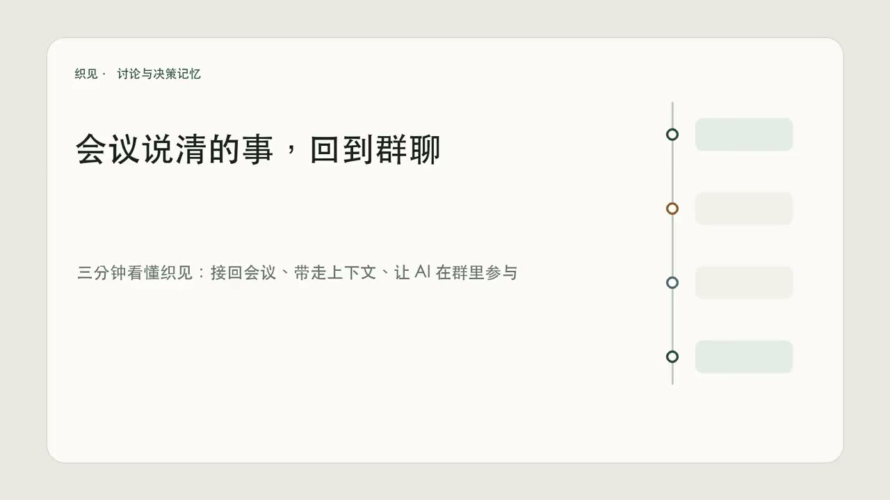

# 织见 · 织讨论，见决策

织见是一套团队讨论与决策记忆原型。它着重解决三个断点：会议纪要难以回到群聊上下文，跨群聊与会议的完整讨论难以带走，AI 的建议难以在原讨论里产生并被团队确认。团队决定会保存为可追溯的结构化档案。

## 在线体验

- [产品主页](https://blog.oppenheimer123.xyz/zhijian/)
- [团队协作 Demo](https://blog.oppenheimer123.xyz/zhijian-team/)
- [校园场景 Demo](https://blog.oppenheimer123.xyz/zhijian-campus/)

## 三分钟产品演示

[](https://github.com/Feynman724/zhijian/releases/download/v1.2.0/zhijian-demo-v1.2.0.mp4)

点击上方产品画面观看完整演示，也可以直接打开：

- [三分钟演示视频（MP4）](https://github.com/Feynman724/zhijian/releases/download/v1.2.0/zhijian-demo-v1.2.0.mp4)
- [中文字幕（SRT）](video/final/zhijian-demo-v1.2.0.srt)
- [中文解说词](video/final/narration-v1.2.0-zh.txt)
- [演示中的 Markdown 导出示例](site/team-demo/examples/产品方向讨论-导出示例.md)
- [对应的 JSON 导出示例](site/team-demo/examples/产品方向讨论-导出示例.json)

## 现阶段解决的问题

1. 把会议转写、原话与共享文件接回群聊里的原议题，保持跨场景的讨论连续性。
2. 导出带有成员、时间、来源与分析结果的结构化讨论上下文，供团队自行保存或交给其他模型分析。
3. 在群里点名机器人，让 AI 的建议回到原讨论，并由成员确认结构化决策。

当前是交互演示原型。团队版 Demo 可预览并下载 Markdown 或 JSON 上下文；实际聊天平台接入和自定义模型 API 尚未实现。

## 演示流程

```text
09:02  群聊提出问题
  ↓
09:30  线上会议展开观点与分歧
  ↓
09:42  会议共享文件并关联原话
  ↓
10:06  会后在群里点名机器人
  ↓
10:12  三人确认结构化决策 D-001
  ↓
三天后  新数据触发决策复核
```

## 仓库结构

```text
site/
  homepage/          产品主页
  team-demo/         团队内部场景 Demo
  campus-demo/       校园组织场景 Demo
  early-prototype/   早期多模态时间线原型

video/
  final/             当前三分钟演示的字幕与解说词；MP4 见 GitHub Release
  product-demo-video/       第一版视频与生成脚本
  product-demo-video-v2/    后续视频版本与生成脚本
```

所有网页均为静态 HTML、CSS 与 JavaScript，可以直接用本地静态服务器运行。例如：

```bash
python3 -m http.server 8000 --directory site/team-demo
```

然后访问 <http://localhost:8000>。

早期原型的逻辑测试：

```bash
cd site/early-prototype
npm test
```

## 设计语言

织见使用低饱和暖灰、墨绿、铜色和灰紫色。群聊、会议、文件、机器人与决策保留各自的来源标识，但共同进入一条连续时间线。主页的品牌规范见 [`site/homepage/brand-spec.md`](site/homepage/brand-spec.md)。

## 团队

- 孙宇杰：技术开发
- 卢格妤：运营与推广
- 张轩灏：产品与用户研究

浙江大学学生创业项目 · 2026
